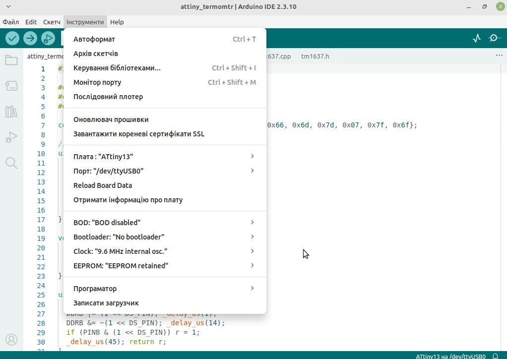

## 🌡️Простий термометр на базі мк Attiny13 дисплею ТМ1637 та датчика температури DS18b20
Код написаний простий без бібліотек тому займає близько 500-530 байт що дуже важливо для цього мк. 

## 🛠 Для роботи потрібно 
1. Прошити через програматор Fuse-bit L: 0x7A, H: 0xFF (мк працює на внутрішньомиу тактовому генераторі). 
2. Прошити через програматор файл attiny_termomtr.ino.hex.
## Якщо ви працюєте через Arduino IDE 
1. Вам потрібно вибрати такі пармметри і прошити через програматор на фото

